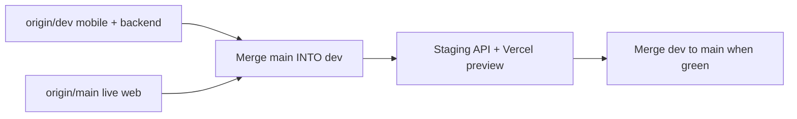

# Dev branch: merge `main` → `dev` and make production-ready

**Audience:** Agent or developer working **on the `dev` branch** of `inventort-seznik`.  
**Repo:** `https://github.com/rishi048229/inventort-seznik`  
**Goal:** Bring **`origin/main` (live web)** into **`dev` (mobile + expanded backend)**, resolve conflicts correctly, and leave **`dev` deployable** as the single integration line before **`dev` → `main`** promotes to production.

---


```text
You are integrating inventort-seznik for production. Work ONLY on the dev branch after checkout.

Mission:
1. git fetch origin main dev
2. Checkout dev, pull origin/dev
3. Merge origin/main INTO dev (not the other way around). Resolve ALL conflicts using .agents/DEV_MAIN_MERGE_HANDOFF.md — especially schema UNION, tenant/auth (ownerId for agents), and frontend rules (keep dev mobile features; port main production web fixes into frontend/ without wholesale replacing main with dev or dev with main).
4. Make dev production-ready: backend builds, additive DB only, frontend builds, mobile-inventory/ builds, no junk binaries in backend/src, staging smoke tests documented.

Hard rules:
- ONE PostgreSQL database for web + mobile. Additive schema only — never drop tables/columns or prisma migrate reset on production.
- mobile-inventory/ changes stay under mobile-inventory/
- Web printers: VEER + DEV only (Web Bluetooth). Mobile keeps full SEZNIK fleet (JOSH, RUDRA, TEJAS, etc.) — shared API/settings, different UI.
- Do NOT merge dev into main until dev passes the Production-ready checklist in the handoff doc.
- Do NOT commit .env, credentials, or large Android SDK blobs under backend/src — move SDK assets to mobile-inventory/ or gitignore.

Deliverables:
- dev branch with merge commit(s), CONFLICTS_RESOLVED.md listing major files and decisions
- Updated ensure-additive-columns.cjs + schema.prisma union
- npm run build passing in backend/ and frontend/
- Short DEPLOY_STAGING.md: commands for EC2 additive SQL + pm2 reload + Vercel preview for frontend/

Read the full handoff: .agents/DEV_MAIN_MERGE_HANDOFF.md
```

---

## Current divergence (verify after fetch)

| Item | Value |
|------|--------|
| Merge-base | `07765371b62f0f4d806407ec9a74117926445240` |
| Commits on `main` not on `dev` | **27** (live production web) |
| Commits on `dev` not on `main` | **422** (mobile line) |
| `main` tip (example) | `fc0243e` — compact VEER/DEV fleet cards |
| `dev` tip (example) | `b481023` — agent login, permissions, TD-404 80mm |

Roughly **~601 files** differ; expect **~90 paths** touched on both sides (backend + `frontend/src/**`).

---

## Strategy: merge on `dev`, then promote



**Why merge `main` → `dev` on `dev`:**  
`dev` already has `mobile-inventory/` and most new APIs. `main` has **27 commits** of production fixes that **dev does not have**. Integrating on `dev` keeps mobile work in one branch until the unified line is validated.

**Do not** fast-forward `main` to old `dev` without this merge — you would lose live web fixes.

---

## Non-negotiable constraints

1. **Live DB** — Production PostgreSQL must survive. Only **additive** Prisma models/columns and `backend/scripts/ensure-additive-columns.cjs` (and `ensureAdditiveSchema.ts` if present).
2. **Same tenant for web + mobile** — Mobile-only registrations must appear in web admin views; existing users unchanged. Agent/staff users must resolve data to **admin `ownerId`** (see auth section).
3. **Monorepo layout after merge:**
   - `backend/` — single API for both clients
   - `frontend/` — Vercel web app (production path today: `main`)
   - `mobile-inventory/` — Expo/React Native (**dev-only today**; must remain after merge)
4. **Printer product policy:**
   - **Web (`frontend/`):** UI shows **VEER + DEV** only; Web Bluetooth; compact fleet cards, `seznik.preferredPrinterModel` in localStorage.
   - **Mobile:** Full fleet, native LPAPI/TD-404, remote print jobs, hardware density/copies/cut — **do not remove**.
   - Prefer **`shared/`** enum/config with `platform: 'web' | 'mobile'` filter if consolidating types.
5. **No destructive git on shared branches** — no force-push to `main`; no `git merge -X theirs` on entire `frontend/` or `schema.prisma`.

---

## Step-by-step workflow

### 0. Preparation

```powershell
git fetch origin main dev
git checkout dev
git pull origin dev
git tag pre-merge-dev-$(Get-Date -Format yyyyMMdd)  # optional safety tag
```

Create a working branch if you want isolation: `integrate/main-into-dev` from `dev`, then PR into `dev`.

### 1. Merge

```powershell
git merge origin/main -m "merge: integrate production main (27 commits) into dev"
```

If merge is too noisy, alternative: merge with `--no-commit`, resolve in chunks, single commit.

### 2. Resolve conflicts in this order

| Order | Path / area | Resolution rule |
|-------|-------------|-----------------|
| 1 | `backend/prisma/schema.prisma` | **UNION** all models and fields from both sides. Never delete production models. |
| 2 | `backend/scripts/ensure-additive-columns.cjs` | Merge SQL from both; every new column/table must have idempotent ADD. |
| 3 | `backend/src/utils/*tenant*`, `ownerUser.ts`, `userId.ts`, `getOwnerUserId` | **One** canonical tenant helper: agent → admin owner; matches **main** agent fix + **dev** mobile endpoints. |
| 4 | `backend/src/middleware/authMiddleware.ts`, `requirePermission` | Keep granular permissions from **dev**; preserve **main** security behavior. |
| 5 | `backend/src/controllers/authController.ts` | Hardest file: combine QR login, device tokens (**dev**) + onboarding/agent workspace (**both**). |
| 6 | `backend/src/app.ts` | Mount **all** routes from **dev**; add **main** routes if missing (e.g. rate limits, utility-bills parity). |
| 7 | KOT / sales / print | Keep **main** `KOTPrintEvent` if **dev** lacks it; keep **dev** print jobs, returns, exchanges APIs. |
| 8 | `backend/src/controllers/utilityBillController.ts` | Reconcile both implementations; single `/api/utility-bills` contract for web kiosk + mobile parser. |
| 9 | Junk on **dev** | Remove or relocate from repo root/backend: `backend/src/Android SDK*`, `.jar`/`.apk` under backend — belong in `mobile-inventory/` or `.gitignore`. |
| 10 | `frontend/src/**` | See **Frontend rules** below — not “pick one branch”. |
| 11 | `mobile-inventory/**` | Prefer **dev** version; add any API base URL env docs if backend paths changed. |
| 12 | `shared/**` | Union; website product catalog + printer enums. |

Document each non-obvious choice in `CONFLICTS_RESOLVED.md` (create at repo root or in `.agents/`).

### 3. Schema union checklist (must exist after merge)

**From dev (typical — verify in diff):**  
`QrLoginSession`, `AccessCode`, `SaleReturn`, `SaleExchange`, `PurchaseReturn`, `PrintJob`, `PrintJobEvent`, `DeviceToken`, `PrinterLog`, `ApiUsageBucket`, `SupplierTransaction`, expanded `Settings` / `User` fields, public receipt support, etc.

**From main (must not lose):**  
`KOTPrintEvent`, `UtilityBill` + user relation, location/multi-store fields if present, agent permission fixes, additive scripts updated on main.

After edit:

```powershell
cd backend
npm install
npx prisma generate
node scripts/ensure-additive-columns.cjs   # against staging DB first
npm run build
```

### 4. Frontend rules (`frontend/`)

**Default:** Treat **`origin/main` as source of truth for live POS/KOT/daybook/utility kiosk/thermal print pipeline** (eject/cut, 2mm tail, VEER/DEV compact fleet, page transitions, agent permissions UI).

**From `dev`, port into merged tree (keep or re-apply):**

- Remote print jobs UI + hooks (if product wants web sender)
- GST/billing panels, hold/restore bills, calculator POS (**feature-flag** if incomplete)
- Public invoice route: wire `PublicInvoicePage` + `/receipt/:id` if backend serves it
- Mobile QR login card on web (optional)
- Receipt preview modals / print job dispatch from recent dev commits

**Do not:**

- Replace entire `frontend/` with pre-merge dev snapshot (loses 27 production commits).
- Remove `UtilityKioskPage`, `printerFleet.ts` VEER/DEV-only list, `PageTransition`, `escpos.ts` eject fixes from main.

When both sides edited the same file, **line-by-line merge** or **main base + cherry-pick dev commits** for that feature.

### 5. Mobile (`mobile-inventory/`)

- Keep all native printer services, Label Studio, calculator billing, offline cache, day close, etc.
- Point app at same API; ensure auth headers and tenant match merged backend.
- Run mobile typecheck/lint/build per project README.

### 6. Feature parity (post-merge epics — not merge blockers)

Use product checklist (web vs mobile gaps). Suggested mobile catch-up order after merge:

1. Purchases, supplier ledger, debit notes  
2. Delivery / COD screens  
3. Tax report, daybook history/export  
4. Return/exchange slips, A4 customization  
5. Settings gaps, KOT config, expiry  

Web catch-up (from mobile): remote print, day close, hold bills, calculator (flagged), richer label studio, camera barcode (optional).

---

## Production-ready checklist (dev must pass before `dev` → `main`)

### Backend

- [ ] `npm run build` succeeds with zero TS errors
- [ ] `schema.prisma` validates; `prisma generate` clean
- [ ] `ensure-additive-columns.cjs` covers all new columns; safe to run twice
- [ ] No secrets or `.env` committed
- [ ] No multi-MB SDK binaries under `backend/src`
- [ ] Smoke tests (manual or script): register/login, agent login → admin store, create sale, KOT create/void, credit customer, utility bill CRUD, print-job create (if enabled), sale return/exchange API

### Frontend (web)

- [ ] `npm run build` succeeds
- [ ] POS checkout + thermal print (58/80mm) — QR/footer not cut off
- [ ] Printers page: VEER/DEV only, connect flow works
- [ ] Utility kiosk works against staging API
- [ ] Agent permissions: restricted staff cannot open forbidden routes
- [ ] Daybook + dashboard load for existing production-like tenant

### Mobile

- [ ] App builds (EAS or local) against **staging** API
- [ ] Login (email/phone), QR login, POS, Bluetooth print (at least one SEZNIK model)
- [ ] Same user sees same products/sales as web for that tenant

### Ops

- [ ] `DEPLOY_STAGING.md`: EC2 pull, `ensure-additive-columns`, `pm2 reload`, env vars unchanged names where possible
- [ ] Vercel **preview** from `dev` for `frontend/` before promoting
- [ ] Rollback plan: tag `pre-merge-dev-*`, DB snapshot before additive script on prod

---

## Known FEATURES.md / product inaccuracies (do not “fix” by deleting code)

- Multi-store / inter-store: web route may be hidden; mobile may lack screen — parity is follow-up work.
- Purchase orders on mobile: incomplete vs web — follow-up.
- POS calculator: mobile-only unless web flag + screen ported.
- Public invoice links: backend may serve `/receipt/:id`; ensure web route exists after merge if product wants share links on web.

---

## Commits on `main` not on `dev` (must be represented after merge)

Verify these themes are present in merged `frontend/` + `backend/` (by merge or manual port):

- Agent accounts see admin store + granular permissions (`f41ac5c` area)
- KOT: rounds, walking orders, cancel without revenue
- Daybook redesign, dashboard GST recap
- POS: print-first checkout, sale PDF download
- Thermal: eject/cut, 2mm tail, sale clock on receipts
- Utility kiosk + fleet localStorage
- VEER/DEV fleet UI (photos, compact cards, shimmer)
- Label rotation fixes, guest bills, tokens (as on main)

Run: `git log --oneline origin/dev..origin/main` and tick each theme.

---

## After dev is green

1. Staging soak (web + mobile) **minimum 24–48h** if possible.  
2. Production DB: snapshot → run additive script → deploy backend from `dev`.  
3. Vercel: merge **`dev` → `main`** (or promote preview).  
4. Mobile store releases: bump version, same API URL as web.  
5. Update `FEATURES.md` with accurate web/mobile matrix.

---

## Files likely to conflict (start here)

- `backend/prisma/schema.prisma`
- `backend/src/app.ts`
- `backend/src/controllers/authController.ts`
- `backend/src/controllers/saleController.ts` (or equivalent)
- `backend/src/middleware/authMiddleware.ts`
- `frontend/src/App.tsx`
- `frontend/src/pages/pos/*`
- `frontend/src/pages/kot/*`
- `frontend/src/pages/printers/PrintersPage.tsx`
- `frontend/src/utils/escpos.ts`, `blePrinter.ts`, receipt/kot slip builders
- `frontend/src/pages/daybook/*`, `dashboard/*`

Use: `git diff --name-only origin/main...HEAD` after failed merge for exact list.

---

## Contact / context

This handoff was written from static analysis + `git fetch` divergence (`27` / `422` commits). Re-run fetch before merging. Prior conversation covered utility bills API, web fleet policy, and thermal print eject fixes on **main**.

**Rule for ongoing work:** Mobile feature development continues in `mobile-inventory/` on **`dev`** until unified branch is promoted to **`main`**.
